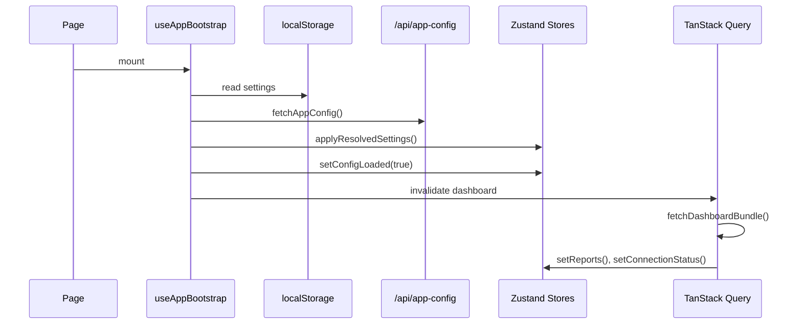
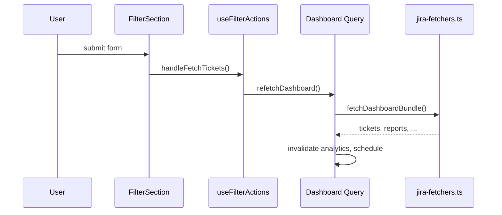
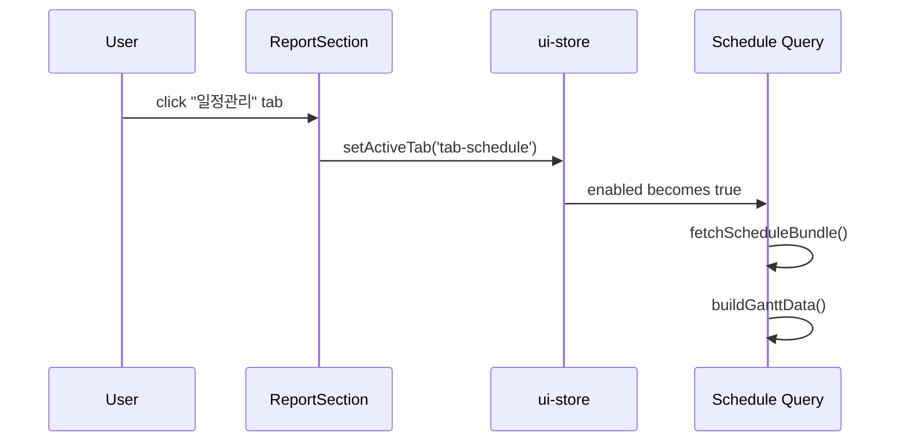

# SprintFlow 상태 관리 가이드

Zustand(클라이언트/UI 상태)와 TanStack Query(서버 상태)를 **기초부터 고급**까지 설명하고, **현재 SprintFlow 프로젝트(TypeScript)**에 어떻게 적용되었는지를 상세히 정리한 문서입니다.

> **언어:** 프로젝트는 **TypeScript**(`strict: true`)로 작성됩니다. Store·Hook·Util은 `.ts`, React 컴포넌트는 `.tsx`를 사용합니다. 공유 타입은 `app/types/index.ts`에 정의되어 있습니다.

---

## 목차

1. [왜 두 가지를 함께 쓰는가?](#1-왜-두-가지를-함께-쓰는가)
2. [Zustand — 기초부터 고급](#2-zustand--기초부터-고급)
3. [TanStack Query — 기초부터 고급](#3-tanstack-query--기초부터-고급)
4. [SprintFlow 아키텍처 개요](#4-sprintflow-아키텍처-개요)
5. [프로젝트 파일 구조](#5-프로젝트-파일-구조)
6. [Zustand Store 상세 (프로젝트)](#6-zustand-store-상세-프로젝트)
7. [TanStack Query 상세 (프로젝트)](#7-tanstack-query-상세-프로젝트)
8. [액션 훅 레이어](#8-액션-훅-레이어)
9. [컴포넌트 연결 방식](#9-컴포넌트-연결-방식)
10. [데이터 흐름 (시퀀스)](#10-데이터-흐름-시퀀스)
11. [설계 원칙 & 주의사항](#11-설계-원칙--주의사항)
12. [기존 useSprintFlow 대비 변경점](#12-기존-usesprintflow-대비-변경점)
13. [TypeScript 적용 (프로젝트)](#13-typescript-적용-프로젝트)

---

## 1. 왜 두 가지를 함께 쓰는가?

| 구분 | Zustand | TanStack Query |
|------|---------|----------------|
| **역할** | 클라이언트/UI 상태 | 서버/API 상태 |
| **예시** | 사이드바 열림, 활성 탭, 입력 폼 값 | Jira 티켓 목록, 분석 데이터 |
| **데이터 출처** | 브라우저 메모리 | API / fetch |
| **캐싱** | 없음 (직접 관리) | staleTime, gcTime 등 내장 |
| **로딩/에러** | 직접 구현 | `isLoading`, `isError` 내장 |
| **동기화** | 즉시 반영 | refetch / invalidate |

**핵심 원칙:** 서버에서 가져온 데이터는 TanStack Query에, UI만의 상태는 Zustand에 둡니다.  
이전 `useSprintFlow.ts`(1,150줄, **삭제됨**)는 이 두 종류를 한 훅에 섞어 **Props Drilling**이 심해졌습니다. 리팩터링 후에는 각 컴포넌트가 필요한 store/query hook만 직접 구독합니다.

```
[이전]
page → useSprintFlow() → AppShell({ app: { layout, settings, filter, stats, reports, schedule } })
                              ↓ props 4~5단계 전달

[이후]
page → useAppBootstrap()
AppShell (props 없음)
  ├─ FilterSection      → useFilterActions() + useSettingsStore()
  ├─ StatsSection       → useStatsActions()
  ├─ ReportSection      → useReportActions()
  ├─ AppSidebar         → useSettingsActions()
  └─ GanttChart         → useUiStore() + useSettingsStore()
```

---

## 2. Zustand — 기초부터 고급

### 2.1 기초: Store 생성

Zustand는 React Context 없이 **전역 store**를 만드는 경량 라이브러리입니다.

```ts
import { create } from 'zustand';

interface CounterState {
  count: number;
  increment: () => void;
  reset: () => void;
}

export const useCounterStore = create<CounterState>((set) => ({
  count: 0,
  increment: () => set((state) => ({ count: state.count + 1 })),
  reset: () => set({ count: 0 }),
}));
```

컴포넌트에서 사용:

```tsx
function Counter() {
  const count = useCounterStore((s) => s.count);
  const increment = useCounterStore((s) => s.increment);

  return <button onClick={increment}>{count}</button>;
}
```

### 2.2 기초: Selector로 리렌더 최소화

store 전체를 구독하면 어떤 필드가 바뀌어도 리렌더됩니다.

```ts
// ❌ 나쁜 예 — store 전체 구독
const state = useCounterStore();

// ✅ 좋은 예 — 필요한 값만 구독
const count = useCounterStore((s) => s.count);
```

SprintFlow의 `DashboardHeader.tsx`도 이 패턴을 사용합니다:

```ts
const connectionStatus = useUiStore((s) => s.connectionStatus);
```

### 2.3 중급: `get()`으로 이전 상태 읽기

`set`만으로는 현재 상태를 읽기 어려울 때 `get()`을 씁니다.

```ts
import { create } from 'zustand';
import type { UiStoreSlice } from '../types';

export const useUiStore = create<UiStoreSlice>((set, get) => ({
  expandedEpics: {},
  toggleEpicCollapse: (epicKey) => {
    const { expandedEpics } = get();
    set({
      expandedEpics: {
        ...expandedEpics,
        [epicKey]: !expandedEpics[epicKey],
      },
    });
  },
}));
```

`GanttChart.tsx`에서 에픽 클릭 시 `toggleEpicCollapse(epic.key)`를 호출하면, 다른 컴포넌트와 **props 없이** 펼침 상태를 공유합니다.

### 2.4 중급: Store 밖에서 상태 변경 (`getState()`)

React 렌더 사이클 밖(부트스트랩, OAuth 콜백, fetch 완료 후)에서는 hook 대신 `getState()`를 사용합니다.

```ts
// use-app-bootstrap.ts
useSettingsStore.getState().applyResolvedSettings(resolved);
useUiStore.getState().setConfigLoaded(true);

// use-dashboard-data.ts — 캘린더 토큰 갱신
useSettingsStore.getState().setCalendarAccessToken(newToken);
```

**언제 쓰는가?**
- `useEffect` 내부의 비동기 콜백
- 이벤트 핸들러에서 여러 store를 한 번에 갱신
- React 컴포넌트가 아닌 순수 함수

### 2.5 중급: 파생 getter

store 안에 **계산된 값**을 노출할 수 있습니다.

```ts
// settings-store.ts
getCredentials: () => {
  const state = get();
  return { url: state.url, email: state.email, token: state.token };
},

hasJiraCredentials: () => {
  const { url, email, token } = get();
  return !!(url && email && token);
},
```

> **주의:** `useSettingsStore((s) => s.getCredentials())`처럼 selector 안에서 호출하면 **매 렌더마다 새 객체**가 만들어질 수 있습니다. Query의 `queryKey`에는 **원시 필드를 개별 구독**하는 방식이 더 안전합니다 (아래 11장 참고).

### 2.6 중급: 일괄 업데이트 (Batch Update)

여러 필드를 한 번에 반영할 때 `set({ ... })` 한 번으로 처리합니다.

```ts
applyResolvedSettings: (resolved: ResolvedSettings) => set({
  url: resolved.url,
  email: resolved.email,
  token: resolved.token,
  apiMode: resolved.apiMode,
  // ...
}),
```

부트스트랩 시 env + localStorage 병합 결과를 한 번에 store에 반영합니다.

### 2.7 고급: Store 분리 (Domain-driven)

하나의 거대 store 대신 **도메인별로 분리**합니다.

| Store | 파일 | 책임 |
|-------|------|------|
| UI | `ui-store.ts` | 레이아웃, 탭, 연결 상태 표시 |
| Settings | `settings-store.ts` | Jira/Confluence/Calendar 설정 |
| Filter | `filter-store.ts` | 조회 필터 (대시보드/분석) |
| Report | `report-store.ts` | 생성된 마크다운 보고서 |

장점:
- 파일 크기·책임이 명확
- 특정 기능 수정 시 영향 범위 축소
- 테스트·디버깅 용이

### 2.8 고급: persist 미들웨어 (참고 — 현재 미사용)

Zustand는 `persist` 미들웨어로 localStorage 동기화를 자동화할 수 있습니다.

```js
import { create } from 'zustand';
import { persist } from 'zustand/middleware';

export const useSettingsStore = create(
  persist(
    (set) => ({
      url: '',
      setUrl: (url) => set({ url }),
    }),
    { name: 'workflow_jira_settings' }
  )
);
```

SprintFlow는 **기존 localStorage 키 구조**(`workflow_jira_settings` 등)와 **서버 env 우선 병합**(`resolveAppSettings`) 로직이 있어, 부트스트랩 훅에서 수동으로 처리합니다. 추후 persist 도입 시 키 이름 호환을 유지해야 합니다.

### 2.9 고급: immer 미들웨어 (참고)

중첩 객체 업데이트가 많을 때:

```js
import { immer } from 'zustand/middleware/immer';

create(immer((set) => ({
  expandedEpics: {},
  toggle: (key) => set((state) => {
    state.expandedEpics[key] = !state.expandedEpics[key];
  }),
})));
```

현재 `expandedEpics` 규모에서는 spread 방식으로 충분합니다.

---

## 3. TanStack Query — 기초부터 고급

### 3.1 기초: Provider 설정

Next.js App Router에서는 Client Component로 Provider를 감쌉니다.

```tsx
// app/providers/QueryProvider.tsx
'use client';

import { QueryClient, QueryClientProvider } from '@tanstack/react-query';
import { useState, type ReactNode } from 'react';

interface QueryProviderProps {
  children: ReactNode;
}

export default function QueryProvider({ children }: QueryProviderProps) {
  const [queryClient] = useState(
    () => new QueryClient({
      defaultOptions: {
        queries: {
          staleTime: 30_000,
          retry: 1,
          refetchOnWindowFocus: false,
        },
      },
    })
  );

  return (
    <QueryClientProvider client={queryClient}>
      {children}
    </QueryClientProvider>
  );
}
```

```tsx
// app/layout.tsx
<QueryProvider>{children}</QueryProvider>
```

SprintFlow 기본값:
- `staleTime: 30s` — 30초간 fresh, 자동 refetch 안 함
- `retry: 1` — 실패 시 1회 재시도
- `refetchOnWindowFocus: false` — 탭 전환 시 자동 refetch 비활성 (Jira API 부하 방지)

### 3.2 기초: useQuery

```js
const { data, isLoading, isError, error, refetch } = useQuery({
  queryKey: ['todos'],
  queryFn: () => fetch('/api/todos').then(r => r.json()),
});
```

| 반환값 | 의미 |
|--------|------|
| `data` | 성공 시 응답 데이터 |
| `isLoading` | 최초 로딩 (캐시 없음) |
| `isFetching` | 백그라운드 refetch 포함 fetch 중 |
| `isError` / `error` | 에러 상태 |
| `refetch()` | 수동 재조회 |

SprintFlow `useDashboardData`:

```js
const query = useQuery({
  queryKey: queryKeys.dashboard(filter),
  queryFn: () => fetchDashboardBundle({ apiMode, credentials, filter, calendar, ... }),
  enabled: isConfigLoaded && !!dateStart && !!dateEnd,
  staleTime: 0,
});
```

### 3.3 기초: queryKey

queryKey는 **캐시 식별자**입니다. 파라미터가 바뀌면 다른 캐시 엔트리가 됩니다.

```ts
// app/lib/query-keys.ts
import type { AnalyticsFilter, DashboardFilter, ScheduleFilter } from '../types';

export const queryKeys = {
  appConfig: ['app-config'] as const,
  dashboard: (filter: DashboardFilter) => ['jira', 'dashboard', filter] as const,
  analytics: (filter: AnalyticsFilter) => ['jira', 'analytics', filter] as const,
  schedule: (filter: ScheduleFilter) => ['jira', 'schedule', filter] as const,
};
```

예시:
```js
['jira', 'dashboard', { projectKey: 'DI26', teamMembers: '김철수', dateStart: '2026-07-14', dateEnd: '2026-07-18' }]
```

필터가 바뀌면 → queryKey 변경 → 자동 refetch.

### 3.4 중급: enabled (조건부 fetch)

아직 준비되지 않았을 때 fetch를 막습니다.

```js
enabled: isConfigLoaded && !!dateStart && !!dateEnd
```

SprintFlow 사용 사례:

| Query | enabled 조건 | 이유 |
|-------|-------------|------|
| Dashboard | `isConfigLoaded && dateStart && dateEnd` | 부트스트랩·날짜 초기화 후 |
| Analytics | `isConfigLoaded && isStatsJqlOpen && 날짜` | 통계 섹션 열릴 때만 (lazy) |
| Schedule | `isConfigLoaded && activeTab === 'tab-schedule'` | 일정 탭 클릭 시만 (lazy) |

### 3.5 중급: staleTime 전략

| Query | staleTime | 이유 |
|-------|-----------|------|
| Dashboard | `0` | "티켓 가져오기"로 항상 최신 데이터 기대 |
| Analytics | `30_000` | 필터 변경 전까지 30초 캐시 |
| Schedule | `60_000` | 일정 데이터는 상대적으로 덜 자주 변경 |

### 3.6 중급: queryFn 분리 (Fetcher Layer)

API 호출 로직을 hook 밖 `app/lib/jira-fetchers.ts`로 분리합니다.

```ts
import type { DashboardBundle, FetchDashboardBundleParams } from '../types';

export async function fetchDashboardBundle(params: FetchDashboardBundleParams): Promise<DashboardBundle> {
  const { apiMode, credentials, filter, calendar } = params;
  if (!apiMode) {
    // Mock 데이터 + 보고서 생성
    return { tickets, nextTickets, reports, statusText, calendarMeta: null, calendarEvents, ... };
  }
  // Jira API + Calendar + 보고서 생성
  return { tickets, nextTickets, calendarEvents, calendarMeta, reports, statusText };
}
```

장점:
- `useQuery` hook은 **언제/어떤 키로** fetch할지만 담당
- fetcher는 **순수 async 함수** → 테스트·재사용 용이
- Mock/API 모드 분기가 한곳에 모임

### 3.7 중급: invalidateQueries (캐시 무효화)

관련 데이터가 바뀌면 연쇄 invalidate합니다.

```js
const refetchDashboard = async () => {
  await queryClient.invalidateQueries({ queryKey: ['jira', 'analytics'] });
  await queryClient.invalidateQueries({ queryKey: ['jira', 'schedule'] });
  return query.refetch();
};
```

대시보드 티켓을 새로 가져오면, 분석·일정 캐시도 stale 처리 → 다음 접근 시 재조회.

부트스트랩 완료 시:

```js
setConfigLoaded(true);
queryClient.invalidateQueries({ queryKey: ['jira', 'dashboard'] });
```

### 3.8 중급: Query 결과 → Zustand 동기화

서버 데이터 중 **파생 UI 상태**(보고서 마크다운)는 fetch 후 store에 반영합니다.

```js
useEffect(() => {
  if (!query.data) return;
  setReports({
    dailyReportMd: query.data.reports.dailyReportMd,
    weeklyReportMd: query.data.reports.weeklyReportMd,
    calendarEvents: query.data.calendarEvents,
  });
  setConnectionStatus({ dot: 'success', text: query.data.statusText });
}, [query.data]);
```

**왜 report-store에 또 저장?**
- 티켓 원본은 Query 캐시에 있음
- 마크다운 보고서는 fetcher에서 **클라이언트 생성**된 파생 데이터
- Confluence 등록, 복사, 다운로드 액션이 report-store를 직접 참조

### 3.9 고급: useMutation (참고 — 현재 미사용)

POST/PUT/DELETE에는 `useMutation`이 적합합니다.

```js
const publishMutation = useMutation({
  mutationFn: (body) => fetch('/api/confluence', { method: 'POST', body }),
  onSuccess: () => queryClient.invalidateQueries({ queryKey: ['reports'] }),
});
```

SprintFlow의 Confluence 등록(`use-report-actions.ts`)은 아직 **직접 fetch**로 구현되어 있습니다. 추후 mutation으로 전환하면 로딩/에러/재시도를 일관되게 관리할 수 있습니다.

### 3.10 고급: prefetchQuery

탭 전환 전 데이터를 미리 로드:

```js
queryClient.prefetchQuery({
  queryKey: queryKeys.schedule(filter),
  queryFn: () => fetchScheduleBundle({ ... }),
});
```

현재는 `enabled: activeTab === 'tab-schedule'`로 lazy load합니다.

### 3.11 고급: React Query Devtools (참고)

개발 시 캐시 상태 확인:

```jsx
import { ReactQueryDevtools } from '@tanstack/react-query-devtools';

<QueryClientProvider client={queryClient}>
  {children}
  <ReactQueryDevtools initialIsOpen={false} />
</QueryClientProvider>
```

---

## 4. SprintFlow 아키텍처 개요

```
┌─────────────────────────────────────────────────────────────┐
│  app/layout.tsx                                             │
│    └─ QueryProvider (TanStack Query Client)                 │
│         └─ app/page.tsx ('use client')                      │
│              └─ useAppBootstrap()  ← localStorage + env     │
│              └─ AppShell (props 없음)                       │
└─────────────────────────────────────────────────────────────┘

┌─────────────── Zustand (클라이언트) ───────────────┐
│ ui-store        │ 사이드바, 탭, 연결 상태, 에픽 펼침 │
│ settings-store  │ Jira/Confluence/Calendar 설정     │
│ filter-store    │ 프로젝트키, 팀원, 날짜 필터        │
│ report-store    │ daily/weekly MD, vacationList      │
└───────────────────────────────────────────────────┘

┌──────────── TanStack Query (서버) ────────────────┐
│ dashboard query  │ tickets + nextTickets + reports │
│ analytics query  │ analyticsTickets (lazy)         │
│ schedule query   │ scheduleTickets → ganttData     │
└───────────────────────────────────────────────────┘

┌──────────── Fetcher Layer ────────────────────────┐
│ jira-fetchers.ts  │ fetchDashboardBundle          │
│                   │ fetchAnalyticsBundle          │
│                   │ fetchScheduleBundle           │
│ generate-reports.ts │ Strategy Pattern 보고서 생성  │
└───────────────────────────────────────────────────┘

┌──────────── Action Hooks (glue layer) ────────────┐
│ use-filter-actions   │ 필터 UI + refetchDashboard  │
│ use-stats-actions    │ 분석 섹션 + analytics     │
│ use-settings-actions │ 설정 저장, OAuth, 팀원      │
│ use-report-actions   │ 탭, 복사, 다운로드, Confluence│
└───────────────────────────────────────────────────┘
```

---

## 5. 프로젝트 파일 구조

```
app/
├── layout.tsx                   # QueryProvider 래핑 (Server Component)
├── page.tsx                     # useAppBootstrap + AppShell
├── types/
│   └── index.ts                 # 공유 타입 (Ticket, StoreSlice, ...)
├── providers/
│   └── QueryProvider.tsx        # QueryClient 생성
├── stores/
│   ├── ui-store.ts
│   ├── settings-store.ts
│   ├── filter-store.ts
│   └── report-store.ts
├── lib/
│   ├── query-keys.ts            # queryKey 팩토리
│   ├── jira-fetchers.ts         # API fetch 함수
│   └── generate-reports.ts      # 보고서 생성
├── components/                  # *.tsx
│   ├── layout/
│   ├── dashboard/
│   └── schedule/
└── hooks/
    ├── typed-stores.ts          # typed Zustand selector 헬퍼
    ├── use-app-bootstrap.ts     # 앱 초기화
    ├── use-dashboard-data.ts    # useQuery: dashboard
    ├── use-analytics-data.ts    # useQuery: analytics
    ├── use-schedule-data.ts     # useQuery: schedule
    ├── use-filter-actions.ts    # 필터 액션
    ├── use-stats-actions.ts     # 통계 액션
    ├── use-settings-actions.ts  # 설정 액션
    └── use-report-actions.ts    # 보고서 액션
```

---

## 6. Zustand Store 상세 (프로젝트)

### 6.1 `ui-store.ts` — UI 전용

| 상태 | 타입 | 용도 |
|------|------|------|
| `mounted` | `boolean` | SSR 하이드레이션 보호 |
| `isConfigLoaded` | `boolean` | 부트스트랩 완료 여부 (Query enabled 조건) |
| `isSidebarOpen` | `boolean` | 사이드바 표시 |
| `isFilterOpen` | `boolean` | 필터 섹션 접기/펼치기 |
| `isStatsJqlOpen` | `boolean` | 통계 섹션 접기/펼치기 (analytics lazy trigger) |
| `activeTab` | `ActiveTab` | `'tab-daily' \| 'tab-weekly' \| 'tab-raw' \| 'tab-schedule'` |
| `expandedEpics` | `Record<string, boolean>` | Gantt 에픽 펼침 상태 |
| `connectionStatus` | `ConnectionStatus` | 헤더 연결 상태 표시 |

Store 타입은 `app/types/index.ts`의 `UiStoreSlice` 인터페이스로 정의됩니다.

**사용 컴포넌트:**
- `AppShell.tsx`, `AppSidebar.tsx` → `isSidebarOpen`
- `DashboardHeader.tsx` → `connectionStatus`
- `FilterSection.tsx` → `isFilterOpen` (via `useFilterActions`)
- `StatsSection.tsx` → `isStatsJqlOpen` (via `useStatsActions`)
- `ReportSection.tsx` → `activeTab` (via `useReportActions`)
- `GanttChart.tsx` → `expandedEpics`, `toggleEpicCollapse`

### 6.2 `settings-store.ts` — 설정 & 자격 증명

Jira URL, API Token, Confluence Space, Google Calendar OAuth 등 **사용자 설정**을 보관합니다.

주요 액션:
- `applyResolvedSettings(resolved)` — 부트스트랩 시 env + localStorage 병합 결과 일괄 반영
- `getCredentials()` / `getCalendarCredentials()` — fetcher에 넘길 객체 생성
- 개별 setter (`setUrl`, `setApiMode`, ...)

**localStorage 저장은 store가 아닌 action hook에서 처리:**
- `use-settings-actions.ts` → `handleSaveSettings`, `handleApiToggle`, 팀원 추가/삭제

### 6.3 `filter-store.ts` — 조회 필터

| 필드 | 용도 |
|------|------|
| `projectKey`, `teamMembers`, `dateStart`, `dateEnd` | 대시보드 티켓 조회 |
| `analyticsProjectKey`, ... | 실적 분석 (별도 필터) |

주요 액션:
- `initDefaultDates()` — 이번 주 월~금, 이번 달 1일~말일 기본값
- `syncFromResolvedSettings()` — env의 PROJECT_KEY / TEAM_MEMBERS 반영

**localStorage 연동 (컴포넌트/액션에서):**
- `workflow_project_key`
- `workflow_filter_members`

### 6.4 `report-store.ts` — 파생 보고서

Query가 fetch한 티켓으로 **생성된 마크다운**을 저장합니다.

```ts
setReports: ({ dailyReportMd, weeklyReportMd, calendarEvents }) => set({
  dailyReportMd,
  weeklyReportMd,
  vacationList: calendarEvents,
}),
```

**사용처:** `use-report-actions.ts` (복사, 다운로드, Confluence 등록)

---

## 7. TanStack Query 상세 (프로젝트)

### 7.1 Dashboard Query — `use-dashboard-data.ts`

**queryKey:**
```js
['jira', 'dashboard', { projectKey, teamMembers, dateStart, dateEnd }]
```

**queryFn:** `fetchDashboardBundle()`

**반환 데이터:** `DashboardBundle` (`app/types/index.ts`)

```ts
{
  tickets: Ticket[];
  nextTickets: Ticket[];
  calendarEvents: CalendarEvent[] | string[];
  calendarMeta: CalendarMeta | null;
  reports: { dailyReportMd: string; weeklyReportMd: string };
  statusText: string;
}
```

**트리거 시점:**
1. 부트스트랩 완료 (`isConfigLoaded = true`)
2. "티켓 가져오기" 버튼 (`refetchDashboard()`)
3. 설정 저장 / API 모드 토글 후 refetch

**부가 처리:**
- `applyCalendarMeta()` — OAuth access token 자동 갱신 → settings-store + localStorage
- `setReports()` — report-store 동기화
- `setConnectionStatus()` — ui-store 헤더 메시지 갱신

### 7.2 Analytics Query — `use-analytics-data.ts`

**queryKey:**
```js
['jira', 'analytics', { analyticsProjectKey, analyticsTeamMembers, analyticsDateStart, analyticsDateEnd }]
```

**enabled:** 통계 섹션이 **열려 있을 때만** fetch (lazy load)

**queryFn:** `fetchAnalyticsBundle()` → `{ tickets, jql }`

**트리거:**
- `StatsSection` 접기/펼치기 → `isStatsJqlOpen` 변경
- `PerformanceAnalytics.tsx`에서 기간 변경 후 "조회" → `refetchAnalytics()`

### 7.3 Schedule Query — `use-schedule-data.ts`

**queryKey:**
```js
['jira', 'schedule', { projectKey, teamMembers }]
```

**enabled:** `activeTab === 'tab-schedule'`

**queryFn:** `fetchScheduleBundle()` → `{ tickets, jql }`

**파생 데이터 (hook 내부 useMemo):**
```js
scheduleTickets → buildEpicScheduleData() → buildGanttData() → ganttData
```

Gantt 차트는 Query 원본이 아닌 **가공된 `GanttData`**를 UI에 전달합니다.

### 7.4 App Config — bootstrap 전용

`fetchAppConfig()`는 Query가 아닌 **부트스트랩 훅에서 직접 호출**합니다.

```ts
envConfig = await fetchAppConfig(); // GET /api/app-config
const resolved = resolveAppSettings(localSettings, envConfig);
```

앱 설정은 1회 로드 + store 반영이므로 별도 Query 캐시 없이 처리합니다.

---

## 8. 액션 훅 레이어

컴포넌트가 store/query를 **직접 조합하지 않도록** glue hook을 둡니다.

### 8.1 `use-app-bootstrap.ts`

```
마운트
  → initDefaultDates()
  → localStorage 읽기
  → fetchAppConfig() (서버 env)
  → resolveAppSettings() 병합
  → settings/filter store 반영
  → OAuth URL 파라미터 처리
  → isConfigLoaded = true
  → dashboard query invalidate
```

### 8.2 `use-filter-actions.ts`

- filter-store 필드 + setter 노출
- `useDashboardData()`의 `isLoading`, `refetchDashboard` 연결
- JQL 복사, 팀원 칩 토글

### 8.3 `use-stats-actions.ts`

- ui-store `isStatsJqlOpen` + filter-store analytics 필드
- `useAnalyticsData()` 연결

### 8.4 `use-settings-actions.ts`

- settings-store CRUD
- localStorage 저장
- Google OAuth 연결/해제
- 저장 후 `refetchDashboard()`

### 8.5 `use-report-actions.ts`

- ui-store `activeTab`
- report-store 마크다운
- `useDashboardData()` tickets (다운로드용)
- Confluence publish (직접 fetch)

---

## 9. 컴포넌트 연결 방식

### 9.1 FilterSection.tsx

```tsx
// props 없음
const registeredMembers = useSettingsStore((s) => s.registeredMembers);
const { projectKey, handleFetchTickets, isLoading, ... } = useFilterActions();
```

### 9.2 GanttChart.tsx

```tsx
// ganttData만 props (Query 파생 데이터)
interface GanttChartProps {
  ganttData: GanttData;
}

const expandedEpics = useUiStore((s) => s.expandedEpics);
const toggleEpicCollapse = useUiStore((s) => s.toggleEpicCollapse);
const jiraUrl = useSettingsStore((s) => s.url);
```

에픽 펼침 상태는 **props drilling 없이** ui-store 공유.

### 9.3 page.tsx — 최소 진입점

```tsx
'use client';

export default function Home() {
  const { mounted } = useAppBootstrap();
  if (!mounted) return <div className="hydration-placeholder" />;
  return <AppShell />;
}
```

---

## 10. 데이터 흐름 (시퀀스)

### 10.1 앱 최초 로드



### 10.2 "티켓 가져오기" 클릭



### 10.3 일정 탭 전환 (lazy load)



---

## 11. 설계 원칙 & 주의사항

### 11.1 상태 분류 기준

| 이 상태면… | 도구 |
|-----------|------|
| API 응답, 서버 원본 | TanStack Query |
| 모달 열림, 탭, 입력값 | Zustand |
| fetch 결과로 **계산된** UI 텍스트 (MD 보고서) | Query → useEffect → Zustand |
| localStorage 영속 | action hook에서 명시 저장 (또는 persist) |

### 11.2 queryKey 안정성

```ts
// ❌ 매 렌더 새 객체 → 무한 refetch 위험
const filter = useFilterStore((s) => s.getDashboardFilter());

// ✅ 원시 필드 개별 구독
const projectKey = useFilterStore((s) => s.projectKey);
const dateStart = useFilterStore((s) => s.dateStart);
const filter: DashboardFilter = { projectKey, teamMembers, dateStart, dateEnd };
```

Analytics/Schedule은 `useMemo`로 filter 객체를 안정화합니다.

### 11.3 여러 컴포넌트가 같은 useQuery hook 호출

`useDashboardData()`를 `FilterSection`, `use-settings-actions`, `use-report-actions`에서 각각 호출해도 **TanStack Query가 동일 queryKey 캐시를 공유**하므로 중복 fetch가 발생하지 않습니다.

### 11.4 Mock vs API 모드

`settings-store.apiMode`가 fetcher 분기 조건입니다.

```js
if (!apiMode) {
  return { tickets: generateMockTickets(...), ... };
}
// else: fetchJiraTickets(...)
```

Query hook은 모드를 구독하므로, API 모드 토글 시 queryKey는 같아도 queryFn 동작이 바뀝니다 → refetch 필요 (`handleApiToggle`에서 처리).

### 11.5 Next.js App Router + TypeScript 주의

- `'use client'` — store/query hook 사용 컴포넌트·훅 (`.tsx` / `.ts`)
- `layout.tsx`는 Server Component 가능 → `QueryProvider.tsx`만 Client
- SSR 시 Zustand 초기값은 서버/클라이언트 동일해야 hydration mismatch 방지 → `mounted` 가드 사용
- 타입 검사: `npm run typecheck` (`tsc --noEmit`)

---

## 12. 기존 useSprintFlow 대비 변경점

| 항목 | 이전 (`useSprintFlow`) | 이후 |
|------|------------------------|------|
| 파일 크기 | ~1,150줄 단일 훅 | store 4 + hook 8 + fetcher 3 |
| Props | `app` 객체 5단계 drilling | props 제거, hook 직접 구독 |
| 티켓 상태 | `useState(tickets)` | Query 캐시 |
| 로딩 | `useState(isLoading)` | `query.isFetching` |
| 분석/일정 | useEffect + useState | `enabled` 조건부 Query |
| 보고서 MD | useState | report-store (Query 결과 sync) |
| 설정 | useState 20+ | settings-store |
| 테스트 | 훅 전체 mock 필요 | fetcher/store 단위 테스트 가능 |
| 언어 | JavaScript (`.js`) | TypeScript (`.ts` / `.tsx`, `strict: true`) |

---

## 13. TypeScript 적용 (프로젝트)

### 13.1 설정 파일

| 파일 | 역할 |
|------|------|
| `tsconfig.json` | `strict: true`, path alias `@/*` |
| `next-env.d.ts` | Next.js 타입 참조 |
| `app/types/index.ts` | 도메인·Store·Fetch 공유 타입 |

### 13.2 파일 확장자 규칙

| 확장자 | 용도 | 예시 |
|--------|------|------|
| `.tsx` | JSX 포함 React 컴포넌트 | `FilterSection.tsx`, `page.tsx` |
| `.ts` | Store, Hook, Util, API Route | `ui-store.ts`, `route.ts` |

### 13.3 Zustand + TypeScript

Store는 `create<SliceInterface>()`로 타입을 지정합니다.

```ts
// app/stores/ui-store.ts
import { create } from 'zustand';
import type { UiStoreSlice } from '../types';

export const useUiStore = create<UiStoreSlice>((set, get) => ({
  // ...
}));
```

Slice 인터페이스는 `app/types/index.ts`에 정의:

```ts
export interface UiStoreSlice {
  mounted: boolean;
  activeTab: ActiveTab;
  connectionStatus: ConnectionStatus;
  setActiveTab: (tab: ActiveTab) => void;
  toggleEpicCollapse: (epicKey: string) => void;
  // ...
}
```

### 13.4 컴포넌트 Props

각 컴포넌트는 `Props` 인터페이스를 정의합니다.

```tsx
// app/components/schedule/GanttChart.tsx
import type { GanttData } from '../../types';

interface GanttChartProps {
  ganttData: GanttData;
}

export default function GanttChart({ ganttData }: GanttChartProps) {
  // ...
}
```

### 13.5 Fetcher / Query 타입

```ts
// app/lib/jira-fetchers.ts
export async function fetchDashboardBundle(
  params: FetchDashboardBundleParams
): Promise<DashboardBundle> { ... }

// app/hooks/use-dashboard-data.ts
const query = useQuery({
  queryKey: queryKeys.dashboard(filter),
  queryFn: () => fetchDashboardBundle({ apiMode, credentials, filter, ... }),
});
```

### 13.6 API Route

```ts
// app/api/app-config/route.ts
import { NextRequest, NextResponse } from 'next/server';

export async function GET(_request: NextRequest) {
  return NextResponse.json(getAppConfig());
}
```

### 13.7 typed-stores 헬퍼 (선택)

`app/hooks/typed-stores.ts`는 Zustand selector에 Slice 타입을 명시적으로 연결하는 헬퍼입니다.

```ts
export const useTypedUiStore = useUiStore as <T>(selector: (state: UiStoreSlice) => T) => T;
```

`create<UiStoreSlice>()`를 사용하면 대부분의 hook/컴포넌트에서 직접 `useUiStore`만으로도 타입이 추론됩니다.

---

## 부록: 새 기능 추가 시 체크리스트

### 서버 데이터(Jira API 등) 추가

1. `app/types/index.ts`에 응답/파라미터 타입 추가
2. `app/lib/jira-fetchers.ts`에 fetch 함수 추가
3. `app/lib/query-keys.ts`에 key 팩토리 추가
4. `app/hooks/use-xxx-data.ts`에 `useQuery` hook 작성
5. 필요 시 action hook + 컴포넌트(`.tsx`) 연결

### UI 상태 추가

1. `app/types/index.ts`의 해당 `*StoreSlice` 인터페이스 확장
2. 도메인에 맞는 store(`.ts`)에 필드 + setter 추가
3. 컴포넌트(`.tsx`)에서 selector로 구독

### 설정값 추가

1. `SettingsStoreSlice` + `settings-store.ts` 필드 + setter
2. `resolveAppSettings.ts` env 병합 (필요 시)
3. `use-settings-actions.ts` localStorage 저장 로직
4. fetcher/query에서 사용

---

## 참고 링크

- [Zustand 공식 문서](https://zustand.docs.pmnd.rs/)
- [TanStack Query 공식 문서](https://tanstack.com/query/latest)
